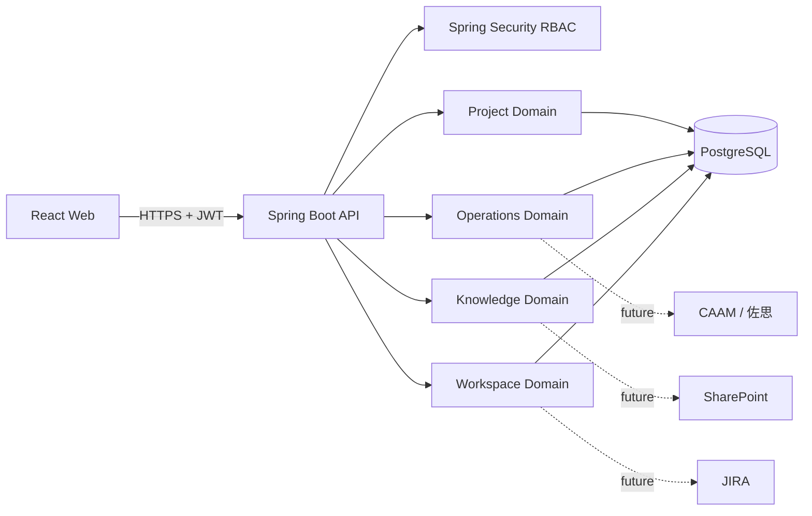
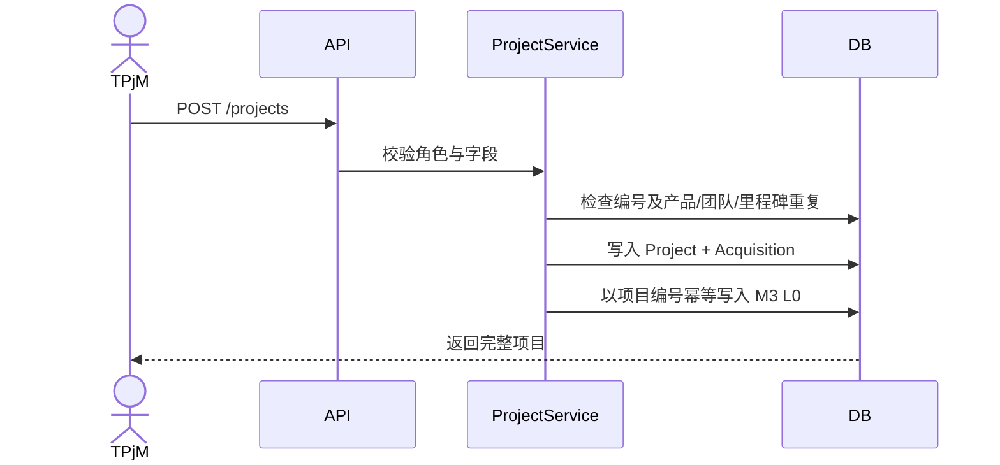

# ODS Platform 架构设计

## 总体架构

ODS 采用前后端分离和模块化单体架构。React Web 通过 JSON REST API 调用 Spring Boot；Spring Security 负责 JWT 身份和角色授权；Spring Data JPA 访问 PostgreSQL；Flyway 管理正式环境数据库版本。H2 只用于本地快速启动和测试。

## 领域边界

| 领域 | 当前能力 | 后续扩展 |
| --- | --- | --- |
| Identity | 用户、JWT、角色、方法级授权 | 刷新令牌、SSO、权限字典、审计日志 |
| Project | M1 项目、Acquisition、M3 L0/L1、软删除、筛选导出 | Outbox 重试、SE 文档、TPM 健康、Excel 导入 |
| Operations | 月度 OEM 销量、份额、环比份额变化、ADAS 可用性 | CSV staging、CAAM/佐思连接器、产品映射 |
| Knowledge | 知识树、培训课程、发布/完成规则、材料状态 | 报名、邮件、日历、提醒任务 |
| Workspace | 个人工单、优先级和状态、视频指南 | JIRA 同步、TR/Clone、视频上传与收藏 |

## 核心流程

### M1 创建与 M3 同步

当前首版采用同一事务同步，确保演示一致性。数据量和外部系统接入后会升级为 Transactional Outbox：项目与事件同事务落库，Worker 按 `dedupeKey` 幂等消费并记录重试。

### 删除规则

- M1 项目 Controller 不暴露 DELETE，符合“项目创建后原则不可删除”。
- M3 使用 `deleted_at` 软删除，保留数据可追溯性。
- Spring Method Security 限制为 `LPM`/`ADMIN`；删除 L0 前检查所有有效 L1。

## API 约定

- 基础路径：`/api/v1`。
- 成功响应：`{"data": ...}`；分页数据包含 `items/page/size/total/totalPages`。
- 错误响应：`code/message/fieldErrors/path/timestamp`。
- 校验错误使用 400，业务规则使用 422，状态冲突使用 409，越权使用 403。
- Swagger UI 在 `/swagger-ui.html`，OpenAPI JSON 在 `/v3/api-docs`。

## 环境策略

| 环境 | 数据库 | Schema 策略 | 启动方式 |
| --- | --- | --- | --- |
| Local | H2 文件库 | Hibernate update | `mvn spring-boot:run` |
| Test | H2 内存库 | create-drop | `mvn test` |
| Compose/Prod | PostgreSQL | Flyway + validate | `docker compose up --build` |

生产环境必须经反向代理启用 TLS，使用独立密钥管理、备份 PostgreSQL，并关闭演示种子数据。
