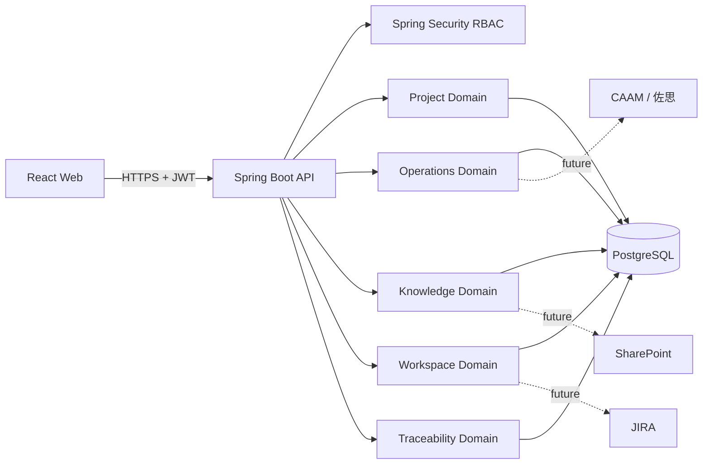
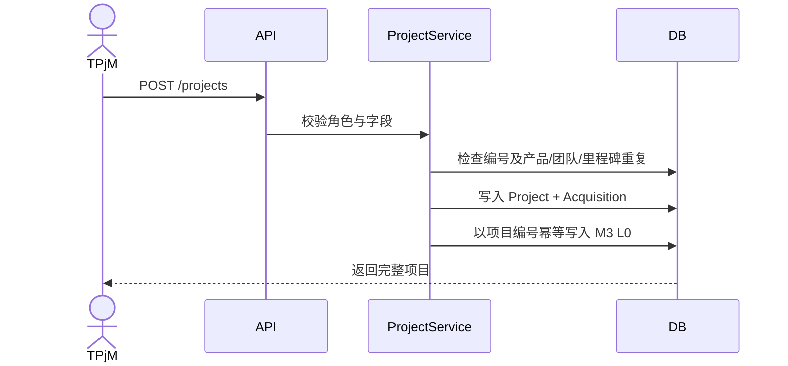

# ODS Platform 架构设计

## 总体架构

ODS 采用前后端分离和模块化单体架构。React Web 通过 JSON REST API 调用 Spring Boot；Spring Security 负责 JWT 身份和角色授权；Spring Data JPA 访问 PostgreSQL；Flyway 管理正式环境数据库版本。H2 只用于本地快速启动和测试。

## 领域边界

| 领域 | 当前能力 | 后续扩展 |
| --- | --- | --- |
| Identity | 用户、JWT、角色、方法级授权 | 刷新令牌、SSO、权限字典、审计日志 |
| Project | M1 项目、Acquisition、M3 L0/L1、软删除、筛选导出 | Outbox 重试、SE 文档、TPM 健康、Excel 导入 |
| Operations | 月度 OEM 销量、份额、环比份额变化、ADAS 可用性 | CSV staging、CAAM/佐思连接器、产品映射 |
| Knowledge | 知识树、培训课程、发布/完成规则、材料状态 | 报名、邮件、日历、提醒任务 |
| Workspace | 个人工单、优先级和状态、视频指南 | JIRA 同步、TR/Clone、视频上传与收藏 |
| Traceability | 工件登记、版本快照、关系维护、双向追溯、变更影响分析、人工复核和工单联动 | 外部工件同步适配器、关系规则配置页面、报告导出 |

## 核心流程

### M1 创建与 M3 同步

当前首版采用同一事务同步，确保演示一致性。数据量和外部系统接入后会升级为 Transactional Outbox：项目与事件同事务落库，Worker 按 `dedupeKey` 幂等消费并记录重试。

### 删除规则

- M1 项目 Controller 不暴露 DELETE，符合“项目创建后原则不可删除”。
- M3 使用 `deleted_at` 软删除，保留数据可追溯性。
- Spring Method Security 限制为 `LPM`/`ADMIN`；删除 L0 前检查所有有效 L1。

### 工件追溯与变更影响分析

追溯模块把需求、算法、硬件、测试、市场说明、培训课程、视频指南和工单统一表示为“工件版本”，再用有方向的关系连接这些版本。查询采用有界广度优先搜索：默认深度为 3，最大深度为 5，最多访问 100 个节点；路径内去重避免环路无限执行，并返回完整路径和截断标记。

影响分析从变更工件出发，依据关系传播方向、关系权重、路径衰减和变更类型匹配系数计算候选分值。分值只用于安排人工复核顺序，不表示安全风险概率。用户必须逐项确认或排除候选，再进行第二次确认；系统才会为每个选中的候选创建一张工单。工单及分析关联在同一事务中保存，任一项失败时整批回滚。历史销量数据保持只读，市场域仅通过单独的市场说明工件进入追溯链。

## API 约定

- 基础路径：`/api/v1`。
- 成功响应：`{"data": ...}`；分页数据包含 `items/page/size/total/totalPages`。
- 错误响应：`code/message/fieldErrors/path/timestamp`。
- 校验错误使用 400，业务规则使用 422，状态冲突使用 409，越权使用 403。
- Swagger UI 在 `/swagger-ui.html`，OpenAPI JSON 在 `/v3/api-docs`。
- 追溯模块主要接口：`/artifacts`、`/relations`、`/trace-queries`、`/changes`、`/impact-reports` 和 `/operation-logs`。

## 环境策略

| 环境 | 数据库 | Schema 策略 | 启动方式 |
| --- | --- | --- | --- |
| Local | H2 文件库 | Hibernate update | `mvn spring-boot:run` |
| Test | H2 内存库 | create-drop | `mvn test` |
| Compose | PostgreSQL | Flyway + validate | `docker compose up --build` |

当前 Compose 是本地开发和部署演练基线。数据库与后端调试端口只绑定 `127.0.0.1`，浏览器统一通过前端 Nginx 的 `/api` 访问后端；数据库、后端和前端均配置健康检查，前端会等待后端健康后再启动。跨设备或域名访问时必须把 `CORS_ALLOWED_ORIGINS` 设置为实际 Web Origin（包含协议和端口）。

正式生产环境还必须在外层网关启用 TLS，使用独立密钥管理或 Docker secrets，建立 PostgreSQL 备份与恢复演练，并设置 `ODS_SEED_ENABLED=false`。当前机器没有 Docker，因此 Compose 启动和 PostgreSQL 容器兼容性仍属于待验证项，详见 [验证记录](verification.md)。
